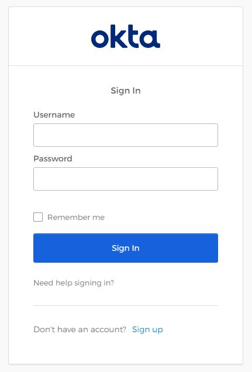
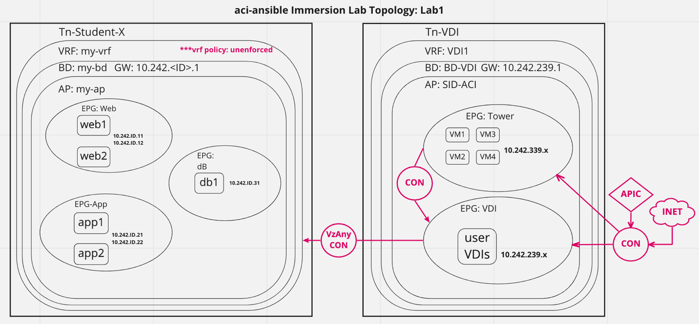
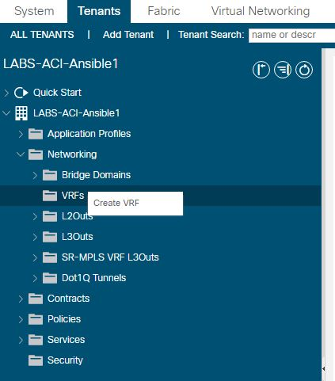
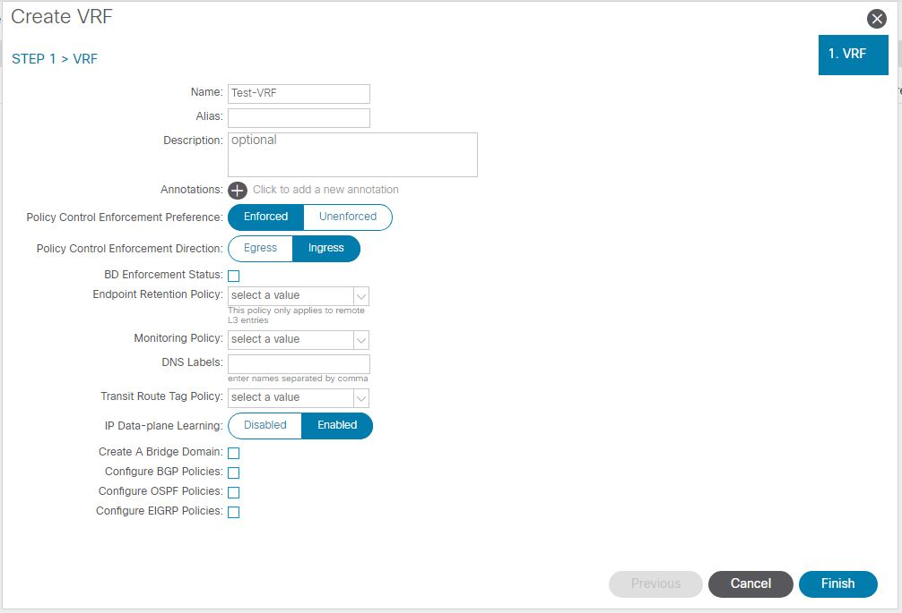
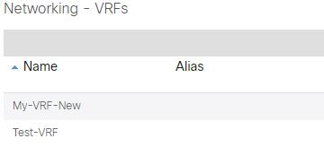
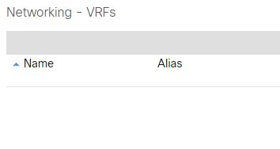
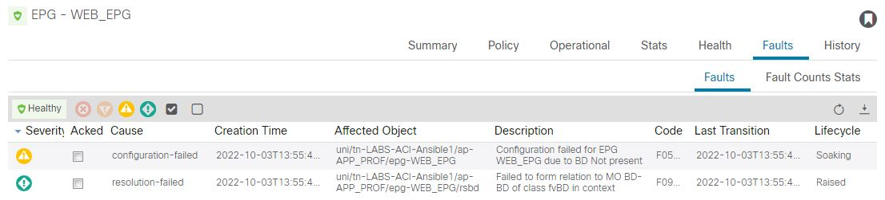
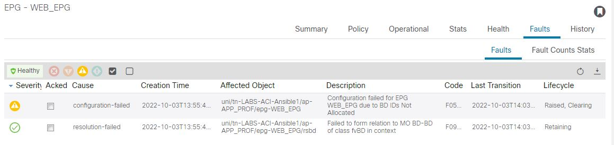

# ACI Ansible Automation Lab
In this lab you will use Ansible playbooks to deploy, modify and remove various objects within a Cisco ACI fabric.  This lab will familiarize you with basic Ansible concepts and structure in the playbooks. Success at various steps will be verified by the user through examination of the ACI GUI and live traffic tests using ICMP, SSH, etc.

You will be required to modify some files during the course of this workshop.  You will not be required to write your own playbooks as this would require much more time.  The playbooks used are open source and thus free to use and modify.  That being said, writing playbooks and running them in a test environment is one of the best ways to learn.

***Disclaimer***:  *The playbooks used in these labs have been created specifically for the lab scenarios used within. Do not run them in any production environment without careful attention to utility and intended function and a complete understanding of their likely outcome.*

<br><br>

# Outline
* Part 1: Technology Intro
    * Cisco Application Centric Infrastructure (ACI)
    * Red Hat Ansible
    * Red Hat Ansible Automation Platform (RHAP)
* Part 2: Lab Access 
    * Okta Account Setup
    * Virtual Desktop
        * ACI GUI
        * Ansible CLI
        * RHAP GUI
* Part 3: Lab 1 - Ansible CLI
* Part 4: Lab 2 - RHAP GUI

<br><br>

# Part 1: Technology Intro
## Cisco ACI
ACI is Cisco’s primary software defined network (SDN) solution for data center. In common with the goals of most SDN solutions, it reduces the management plane to a single pane of glass, for an entire data center fabric. The single pane of glass is a controller (the APIC) which is a redundant cluster that distributes the user defined policy to the fabric itself which services the data plane. The controller does not itself participate in the fabric state except to effect change instructions; it merely distributes configurations and accepts telemetry from the fabric components to provide centralized monitoring of network health.

## Red Hat Ansible
Orchestration and automation are not the same thing. But, Ansible can do both. Automation usually is implemented to fulfil a goal to replicate identical or near-identical repetitive actions. For example, the automatic transmission. Using a similar analogy, orchestration is akin to what the “self-driving car” does. Its controller must gather multiple inputs and react correctly, in near real time and provide adaptive change to critically co-dependent entities (e.g. steering, brakes, throttle).

Ansible is not at the heart of the self-driving car (we hope), but it is a good fit for creating and deleting complete “systems” (or parts of systems) like network, compute, and storage which all have interdependencies. Orchestration of these entities makes sense because the discrete components (combined) create a system. Deployed in isolation they each provide (almost) no function and require subsequent “manual” orchestration to become an actual “system”. Taking “manual” siloes out therefore creates opportunities for the value-add of accuracy, efficiency and de-risking repeat orchestrations.

## Cisco ACI
ACI is Cisco's primary software defined network (SDN) solution for data center. In common with the goals of most SDN solutions, it reduces the management plane to a single pane of glass, for an entire data center fabric. The single pane of glass is a controller (the APIC) which is a redundant cluster that distributes the user defined policy to the fabric itself which services the data plane. The controller does not itself participate in the fabric state except to effect change instructions; it merely distributes configurations and accepts telemetry from the fabric components to provide centralized monitoring of network health.

<br><br>

# Part 2: Lab Access
## Okta Account Setup
1. Navigate to https://siriussdx.okta.com/
2. Create an account if you do not currently have one by selecting the "Sign up" link at the bottom of the login box.<br>



## Virtual Desktop
Once logged into Okta, under "My Apps" select "ACI Ansible Automation Lab."  This will launch the virtual desktop that you will use to access the lab resources.
* ACI GUI
  1. Launch the "ACI GUI" icon located on the desktop from inside the lab.
  2. Login with the appropriate credentials.
* Ansible CLI
  1. Launch the "Terminal" icon located on the desktop from inside the lab.
* RHAP GUI
  1. Launch the "RHAP GUI" icon located on the desktop from inside the lab.
  2. Login with the appropriate credentials.

<br><br>

# Part 3: Lab 1 - Ansible CLI
1. Review the 3-tier application topology. 
1. Review the [Lab 1 repository](https://github.com/sdxic/LABS-ACI-Ansible/lab1/)
1. Manually deploy a VRF in ACI
    * In the ACI GUI navigate to `Tenants -> LABS-ACI-AnsibleX -> Networking -> VRFs`.<br>
    * Right click on VRFs and selected `Create VRF`.<br>
    Enter any value in the `Name` field.<br>
    ***Uncheck: `Create A Bridge Domain`***<br>
    <br>
    Select the `Finish` button
1. Repeat step 3 creating a second VRF with a different name.
    
1. Open a terminal and clone the repository.
    ```bash
    user@localhost:~/LABS-ACI-Ansible/lab1$ git clone https://www.github.com/sdxic/LABS-ACI-Ansible/LABS-ACI-Ansible.git
    ```
1. Change to the `LABS-ACI-Ansible/lab1` directory.  List the files in this directory with the `ls` command.
    ```bash
    user@localhost:~$ cd LABS-ACI-Ansible/lab1
    user@localhost:~/LABS-ACI-Ansible/lab1$ ls
    collections  deploy_ap_epg.yml  deploy_binding.yml  deploy_contract.yml  deploy_logical.yml  deploy_vrf_bd.yml  remove_all.yml  remove_vrf.yml  vars.yml
    ```
1. Review & run the `remove_vrf.yml` playbook.
    ```bash
    user@localhost:~/LABS-ACI-Ansible/lab1$ ansible-playbook remove_vrf.yml 
    PLAY [Remove all VRFs] **********************************************************************

    TASK [Gathering Facts] **********************************************************************
    ok: [localhost]

    TASK [Query all VRFs] ***********************************************************************
    ok: [localhost -> localhost]

    TASK [Remove a VRF for a tenant] ************************************************************
    changed: [localhost -> localhost] => (item=Deleting VRF: My-VRF-New)
    changed: [localhost -> localhost] => (item=Deleting VRF: Test-VRF)

    PLAY RECAP **********************************************************************************
    localhost                  : ok=3    changed=1    unreachable=0    failed=0    skipped=0    rescued=0    ignored=0   

    user@localhost:~/LABS-ACI-Ansible/lab1$ 
    ```
    Note the changes in the ACI GUI live as the playbook runs.  You should see all VFRs previously created will be deleted.<br>
    
1. Review the `remove_vrf.yml` file.  Note the module `cisco.aci.aci_vrf` that is utilized in the playbook.  This module is written in python and provides the underlying code which takes input from the playbooks and interprets back and forth to the ACI APICs.
1. Run the `ansible-doc cisco.aci.aci_vrf` command to view the documentation related to this module.  Look towards the bottom of the output to find examples typically containing `query`, `add` and `remove` snippets.<br>
    ```bash
    user@localhost:~/LABS-ACI-Ansible/lab1$ ansible-doc cisco.aci.aci_vrf
    > ACI_VRF    (/home/user/.ansible/collections/ansible_collections/cisco/aci/plugins/modules/aci_vrf.py)

            Manage contexts or VRFs on Cisco ACI fabrics. Each context is a private network associated to a tenant, i.e. VRF. Enable Preferred Groups for VRF

      * This module is maintained by an Ansible Partner
    OPTIONS (= is mandatory):

    ... redacted ...

    EXAMPLES:

    - name: Add a new VRF to a tenant
      cisco.aci.aci_vrf:
        host: apic
        username: admin
        password: SomeSecretPassword
        vrf: vrf_lab
        tenant: lab_tenant
        descr: Lab VRF
        policy_control_preference: enforced
        policy_control_direction: ingress
        state: present
      delegate_to: localhost

    - name: Remove a VRF for a tenant
      cisco.aci.aci_vrf:
        host: apic
        username: admin
        password: SomeSecretPassword
        vrf: vrf_lab
        tenant: lab_tenant
        state: absent
      delegate_to: localhost

    - name: Query a VRF of a tenant
      cisco.aci.aci_vrf:
        host: apic
        username: admin
        password: SomeSecretPassword
        vrf: vrf_lab
        tenant: lab_tenant
        state: query
      delegate_to: localhost
      register: query_result
    ```image.png
1. Run playbook `deploy_ap_epg.yml` and review any EPG faults for the newly created objects.  Navigate to `Application Profiles -> APP_PROF -> Application EPGs -> WEB_EPG`.  Select `Faults` from the right side menu.<br>
    ```bash
    user@localhost:~/LABS-ACI-Ansible/lab1$ ansible-playbook deploy_ap_epg.yml 
    PLAY [Deploy Application Profile and EPGs] **************************************************

    TASK [Gathering Facts] **********************************************************************
    ok: [localhost]

    TASK [Deploy Application Profile] ***********************************************************
    ok: [localhost -> localhost]

    TASK [Deploy Endpoint Group] ****************************************************************
    changed: [localhost -> localhost] => (item=WEB_EPG)
    changed: [localhost -> localhost] => (item=APP_EPG)
    changed: [localhost -> localhost] => (item=DB_EPG)

    PLAY RECAP **********************************************************************************
    localhost                  : ok=3    changed=1    unreachable=0    failed=0    skipped=0    rescued=0    ignored=0   

    user@localhost:~/LABS-ACI-Ansible/lab1$ 

    ```
    <br>
    Why are we seeing fault(s)? What do the fault(s) mean and how can we fix them?
1. Run playbook `deploy_vrf_bd.yml` and observe the faults page for any changes.  You should see the lifecycle status change to `"Soaking, Clearing"` or `"Raised, Clearing"` or similar.<br>
    ```bash
    user@localhost:~/LABS-ACI-Ansible/lab1$ ansible-playbook deploy_vrf_bd.yml 
    PLAY [Deploy VRF and Bridge Domain] *********************************************************

    TASK [Gathering Facts] **********************************************************************
    ok: [localhost]

    TASK [Deploy VRF] ***************************************************************************
    changed: [localhost -> localhost]

    TASK [Deploy Bridge Domain] *****************************************************************
    changed: [localhost -> localhost]

    TASK [Deploy Bridge Domain Subnet] **********************************************************
    changed: [localhost -> localhost]

    PLAY RECAP **********************************************************************************
    localhost                  : ok=4    changed=3    unreachable=0    failed=0    skipped=0    rescued=0    ignored=0   

    user@localhost:~/LABS-ACI-Ansible/lab1$ 
    ```
    <br>
    > *Note: it may take up to 2 minutes for the faults to fully clear.*
1. Run playbook `remove_all.yml` and observe changes in the ACI GUI.  What did you notice?  Your tenant should be blank and all VRFs, EPGs, APs and BDs will have been removed.
    ```bash
    user@localhost:~/LABS-ACI-Ansible/lab1$ ansible-playbook remove_all.yml
    PLAY [Remove all VRFs BDs and APs] **********************************************************

    TASK [Gathering Facts] **********************************************************************
    ok: [localhost]

    TASK [Query all VRFs] ***********************************************************************
    ok: [localhost -> localhost]

    TASK [Remove a VRF for a tenant] ************************************************************
    changed: [localhost -> localhost] => (item=Deleting VRF: VRF)

    TASK [Query all AP in Tn] *******************************************************************
    ok: [localhost -> localhost]

    TASK [Remove the APs] ***********************************************************************
    changed: [localhost -> localhost] => (item=Deleting AP: APP_PROF)

    TASK [Query all Bridge Domains in Tn] *******************************************************
    ok: [localhost -> localhost]

    TASK [Delete all the Bridge Domains Found] **************************************************
    changed: [localhost -> localhost] => (item=Deleting BD: BD)

    PLAY RECAP **********************************************************************************
    localhost                  : ok=7    changed=3    unreachable=0    failed=0    skipped=0    rescued=0    ignored=0   

    user@localhost:~/LABS-ACI-Ansible/lab1$ 
    ```
1. Run playbook `deploy_logical.yml`.  Review the objects that are created in the ACI GUI.  You should see all of the objects that were previously deleted have been redeployed using a single playbook.
    ```bash
    user@localhost:~/LABS-ACI-Ansible/lab1$ ansible-playbook full_logical.yml 
    PLAY [Deploy Full Logical Configuration] ****************************************************

    TASK [Gathering Facts] **********************************************************************
    ok: [localhost]

    TASK [Deploy VRF] ***************************************************************************
    changed: [localhost -> localhost]

    TASK [Deploy Bridge Domain] *****************************************************************
    changed: [localhost -> localhost]

    TASK [Deploy Bridge Domain Subnet] **********************************************************
    changed: [localhost -> localhost]

    TASK [Deploy AP] ****************************************************************************
    changed: [localhost -> localhost]

    TASK [Deploy EPG] ***************************************************************************
    changed: [localhost -> localhost] => (item=WEB_EPG)
    changed: [localhost -> localhost] => (item=APP_EPG)
    changed: [localhost -> localhost] => (item=DB_EPG)

    PLAY RECAP **********************************************************************************
    localhost                  : ok=6    changed=5    unreachable=0    failed=0    skipped=0    rescued=0    ignored=0   

    user@localhost:~/LABS-ACI-Ansible/lab1$ 
    ```
1. Run playbook `deploy_contract.yml` and verify contracts now exist between EPGs.

>Lab 1 Complete!  You should now be familiar with basic Ansible and ACI concepts and integrations.  Proceed to Lab 2 for an introduction into Red Hat Ansible Automation Platform.

<br><br>

# Part 4: Lab 2 - RHAP GUI
1. Explore the RHAP GUI.
1. Create credentials for ACI.
    * Select `Resources -> Credentials` under the left menu and then the `Add` button to create a new set of credentials.
    * Fill in a `Name` and set `Credential Type` = `Network`.
    * Input your username in the format `aci-ansibleX` where `X` is your lab number.  (e.g. `aci-ansible3`) for lab 3.
1. Create a project and sync with repository.
1. Create an inventory for ACI.
1. Create `Initial Config` job template.
1. Create `Deploy Contract` job template.
1. Run the `Initial Config` and `Deploy Contract` job templates.
1. Review job execution history and details.
1. Create and run `VRF Enforcement` job template.
1. Create `Remove vzAny Contract` job template.
1. Create `Enable Preferred Group` job template.
1. Create `Deploy EPG Contract` job template.
1. Create `Deploy Jumpbox Contract` job template.
1. Create and run `Deploy Strict Access` ***workflow*** template.
1. Create and run `Disable Preferred Group` job template.
1. Create and run `Deploy Web-App Contract` job template.

>Lab 2 Complete!  You should now be familiar with basic tasks in Red Hat Ansible Automation Plaform.